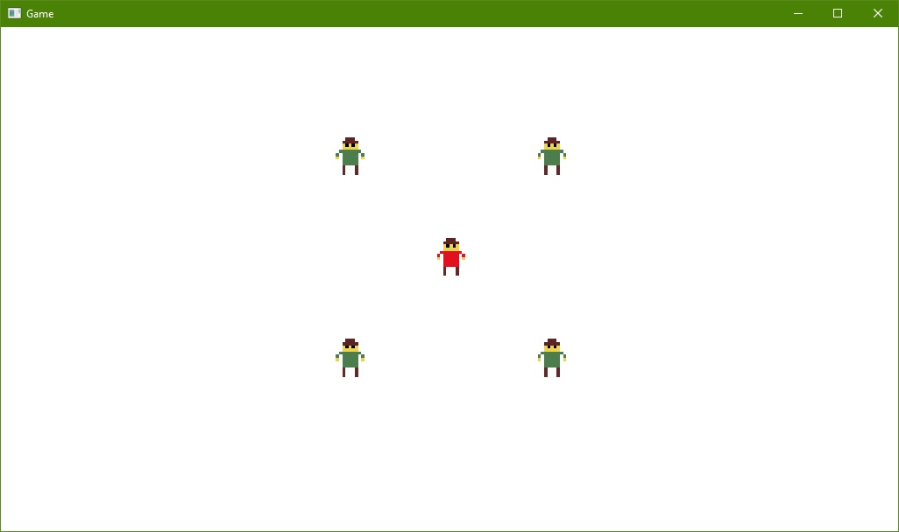

# Description
An unnamed 2D game that will mix softcore adventure roleplaying elements (ex. character progression) with unforgiving hardcore roguelike genre (ex. permadeath). The game will utilize procedural generation. Design process is ongoing along with the development progress.



# Motivation
My motivation is to finally complete and publish a commercial game. After so many abandoned projects, I'll either finish this one or most likely move away from game development entirely. I have some time before I (hopefully) start university by the end of this year. This is my last chance to try breaking into the industry as an indie developer. A last good shot at making my life dreams come true this year. Wish me luck!

# Postmortem
If you are reading this, then it means the project failed. I ended getting up a position as a game tester and stopped working on this engine. I am starting unversity soon and moving to different game projects.

Notable features that have been implemented:
- Entity/Component system
- Game scripting layer using Lua
- Wrapper for OpenGL API
- Resource lifetime management
- Logger that uses stream operators

# Requirements
- CMake 3.1 (or higher)
- Visual Studio 2015 (preferably)
- All other dependencies are included.

# How To Build
1. Run one of the batch files located in Build directory. (```Build/CMake-VS2015.bat```)
2. Open the solution file in the generated directory. (```Build/CMake-VS2015/Project.sln```)
3. Build and run the application. (press F5 on Visual Studio 2015)

# License

The MIT License (MIT)

Copyright (c) 2016 Piotr Doan

Permission is hereby granted, free of charge, to any person obtaining a copy of this software and associated documentation files (the "Software"), to deal in the Software without restriction, including without limitation the rights to use, copy, modify, merge, publish, distribute, sublicense, and/or sell copies of the Software, and to permit persons to whom the Software is furnished to do so, subject to the following conditions:

The above copyright notice and this permission notice shall be included in all copies or substantial portions of the Software.

THE SOFTWARE IS PROVIDED "AS IS", WITHOUT WARRANTY OF ANY KIND, EXPRESS OR IMPLIED, INCLUDING BUT NOT LIMITED TO THE WARRANTIES OF MERCHANTABILITY, FITNESS FOR A PARTICULAR PURPOSE AND NONINFRINGEMENT. IN NO EVENT SHALL THE AUTHORS OR COPYRIGHT HOLDERS BE LIABLE FOR ANY CLAIM, DAMAGES OR OTHER LIABILITY, WHETHER IN AN ACTION OF CONTRACT, TORT OR OTHERWISE, ARISING FROM, OUT OF OR IN CONNECTION WITH THE SOFTWARE OR THE USE OR OTHER DEALINGS IN THE SOFTWARE.
